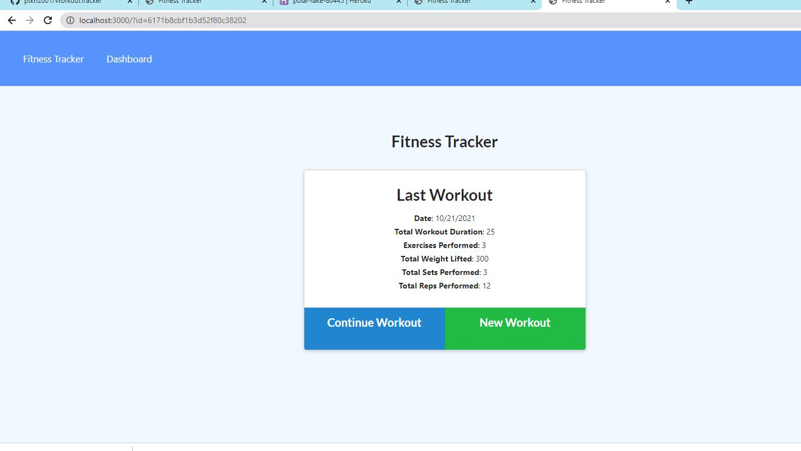
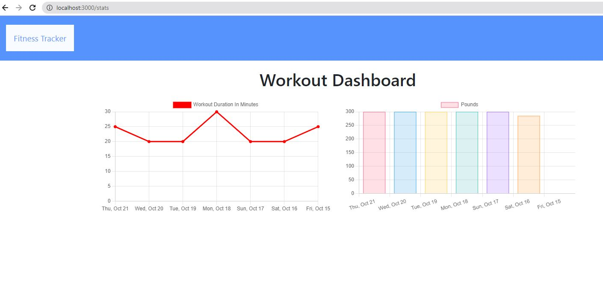

# Workout-Tracker - Unit 18 Nosql

## Description

This app will allow a user to view create and track daily workouts. The user will be able to log multiple exercises in a workout on a given day. The app will also be able to track the name, type, weight, sets, reps, and duration of exercise. If the exercise is a cardio exercise, the app will be able to track the distance traveled and present the past 7 workouts in a graph on the dashboard page.

## Acceptance Criteria

When the user loads the page, they should be given the option to create a new workout or continue with their last workout.

The user should be able to:

  * Add exercises to the most recent workout plan.

  * Add new exercises to a new workout plan.

  * View the combined weight of multiple exercises from the past seven workouts on the `stats` page.

  * View the total duration of each workout from the past seven workouts on the `stats` page.

## Deployed Website
[Workout-Tracker](https://polar-lake-80445.herokuapp.com/) * MIT License

## Technologies Used

* 

* 

* 

* `Deployed with Heroku and MongoDB Atlas` 

  * 

  * 
 
 

 ## Example screen shots:
 

 

## My Contact info
- Ron Shutter | [ Github Profile](https://github.com/Proton-8) | <a href="mailto:ronashutter@gmail.com"> email</a> |<a href="https://www.linkedin.com/in/ron-shutter-95613211/"> LinkedIn</a> 
    

